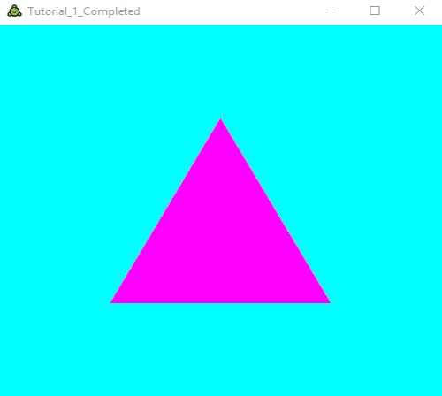

# Tutorial 1

## Goals
* Understand the basic setup of a FUSEE application.
* Understand rendering pipeline basics.
* Send simple geometry through the rendering pipeline.

## Getting Started
* Install and run FUSEE and its dependencies as explained on the [FUSEE Website](https://www.fusee3d.org).

* Download or clone this repository to your computer and open this folder (`Tutorial_1`) in Visual Studio Code.

* Since we will be working with the GLSL Shader language, install the [Language Support Extension](https://marketplace.visualstudio.com/items?itemName=slevesque.shader) for VS Code.

* Go to the Debug view of Visual Studio Code by selecting it in the Activity Bar on the side (or by pressing `Ctrl+Shift+D`).

* At the top, open the dropdown menu and select either `Debug in FUSEE Player` or `Debug in FUSEE Web Player`. If you click `Start Debugging` (the play icon), you should see a window with a simple white background.

* In general, FUSEE applications can be built for both Desktop or Web environments. To do so, use the console command `"fusee publish --platform Web"` or `"fusee publish --platform Desktop"`.

    * You can find the published files in `/pub/Desktop` or `/pub/Web` respectively.

## Basic Structure
* This folder contains one class, `Tutorial_1.cs`. This contains the application logic, right now consisting of three methods:

    * `Init` - Called once on application startup. You can place initialization code here. Currently, `Init` only sets the clear color

        ```csharp
        public override void Init()
        {
            RC.ClearColor = new float4(1, 1, 1, 1);
        }
        ```

    * `RenderAFrame` - Called to generate image contents (once per frame). You can place drawing and interaction code here. Currently, `RenderAFrame` just clears the background of the backbuffer and copies the backbuffer contents to the front buffer.

        ```csharp
        public override void RenderAFrame()
        {
            // Clear the backbuffer
            RC.Clear(ClearFlags.Color | ClearFlags.Depth);

            // Copy backbuffer contents to the front buffer.
            Present();
        }
        ```
    
    * `Resize` - Called when the render window is resized (or initialized). We will oook at this method later.

* Try to change the color of the render window background by altering the first three components of the `float4` value assigned to `RC.ClearColor`. These values are red,green, and blue intensities in the range from 0 to 1.

## The Rendering Pipeline
Before we can draw some geometry, we need a simple understanding how the graphics card works. You can imagine the graphics card (GPU) as a pipeline. On the one end, you put in (3D-)Geometry and on the other end a rendered two-dimensional pixel image drops out. The conversion from the vector geometry into pixel images is done in two major steps:

1. The coordinates of the geometry's vertices are converted into screen coordinates.

2. The vector geometry (in screen coordinates) is "rasterized" - that is, each pixel in the output buffer covered by geometry is filled with a certain color.

You can control both steps by placing small programs on the GPU's processor. These programs are called "Shaders". A program performing the coordinate transformation fom whatever source-coordinate system to screen coordinates is called "Vertex Shader". A program performing the color calculation of each pixel to fill is called "Pixel Shader". In FUSEE you need to provide a Pixel and a Vertex Shader if you want to render geometry. The programming language for shaders used in FUSEE is GLSL, the shader language supported by OpenGL.


## Add a Shader Effect
Now let's create our first ShaderEffect using a simple pair of Vertex- and Pixel-Shaders.

* First, locate the `PixelShader.frag` and `VertexShader.vert` files in the `Assets` folder. (The `.vert` file extension is used for vertex shaders while `.frag` is used for fragment shaders, the OpenGL terminology for pixel shaders.)

* Open `PixelShader.frag` and add the following code:

    ```glsl
    #ifdef GL_ES
        precision highp float;
    #endif

    uniform vec4 DiffuseColor;

    void main()
    {
        gl_FragColor = DiffuseColor;
    }
    ```

    This pixel shader simply fills each pixel it is called for (`gl_FragColor`) with a color specified in the uniform variable `DiffuseColor`. There will be more explanation on uniform variables in a later tutorial, but for now it is enough to know that we can change the variable from outside the shader code itself.

* Now add the following code to `VertexShader.vert`:

    ```glsl
    attribute vec3 fuVertex;

    void main()
    {
        gl_Position = vec4(fuVertex, 1.0);
    }
    ```

    This vertex shader takes each given incoming vertex (`fuVertex`) and copies it to the resulting vertex (`gl_Position`) while adding a fourth dimension (constantly set to 1.0).

* With the shader set, let's move on to the `Tutorial_1` file. First, we need to add the shader files so we can use them later on. For that, we will define three fields to the `Tutorial_1` class.

    ```csharp
    private ShaderEffect _shaderEffect;

    private string _vertexShader = AssetStorage.Get<string>("VertexShader.vert");
    
    private string _pixelShader = AssetStorage.Get<string>("PixelShader.frag");
    ```

* Now we will move on to the `Init` method where we will actually build the shader effect and set it as the current shader effect.

    ```csharp
    _shaderEffect = new ShaderEffect(
        new[]
        {
            new EffectPassDeclaration{VS = _vertexShader, PS = _pixelShader, StateSet = new RenderStateSet{}}
        },
        new[]
        {
            new EffectParameterDeclaration { Name = "DiffuseColor", Value = new float4(1, 0, 1, 1) }
        }
    );

    RC.SetShaderEffect(_shaderEffect);
    ```

    As you can see, the constructor for the ShaderEffect takes two arguments:
    
    1. An array of effect passes that are applied to the geometry in the order they are called. Each effect pass contains a vertex shader, pixel shader, as well as a set of render states that are applied before each pass. Render states can be used to only render points, wireframes, as well as blend textures. For our purposes, however, we can leave that list empty, as we want a simple solid color.

    2. A list of (uniform) parameters that might be used in one of the shaders in the effect passes. This is wehere we set the `DiffuseColor` for our pixel shader.

## Add Mesh
* At the `Tutorial_1` class level, create a private `Mesh` field.

    ```csharp
    private Mesh _mesh;
    ```

* Inside the `Init` method, initialize a mesh with a single triangle.

    ```csharp
    _mesh = new Mesh
    {
        Vertices = new[]
        {
            new float3(-0.5f, -0.5f, 0),
            new float3(0.5f, -0.5f, 0),
            new float3(0, 0.5f, 0),
        },
        Triangles = new ushort[] { 0, 1, 2 },
    };
    ```

* In the `RenderAFrame` method, draw the mesh *after* the backbuffer was cleared, but *before* the backbuffer content is presented.

    ```csharp
    RC.Clear(ClearFlags.Color | ClearFlags.Depth);

    RC.Render(_mesh);

    Present();
    ```

* Debug the program for you favorite platform. A magenta colored triangle should fill the background.

    

* See [Tutorial 1 Completed](../Tutorial_1_Completed) for the overall state so far.

## Exercise/Questions
Investigate how the vertice's coordinates relate to pixel positions within the output window.

* What are the smallest and largest x- and y-values for vertices that can be displayed within the output window?

* What happens to your geometry if you re-size the output window?

* What happens if you change the z-values of your vertices (currently set to 0)?

Understand how the `Triangles` are indices into the `Vertices` array.

* Add another vertex to the `Vertices` array.

* Add another triangle (three more indices) to the `Triangles` array to display a rectangle. (Using a total of four entries in `Vertices` and six entries in `Triangles`.)

* What happens if you change the order of the indices in the `Triangles` array? Try to explain the observation.

Understand the concept of "the current Shader".

* Add one more geometry `Mesh` and another `ShaderEffect` (setting a different color). Store both shaders in fields rather than in local variables.

* Within `RenderAFrame` render each of the two meshes with a different shader (call `RC.SetShader` before `RC.Render`).