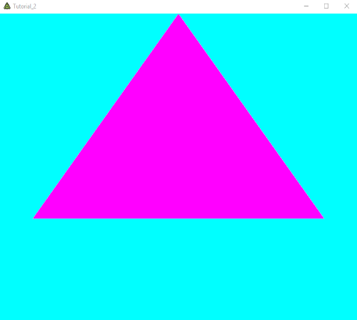

# Tutorial 2

## Goals
* Understanding how geometry is pumped through the rendering pipeline.

* Understaning `unifrom`, `attribute` and `varying` shader variables.

* Understand how data is passed from pixel to vertex shader.

* Grasp basics of 3D transformation.

## Prerequisites
* Make sure you got [Tutorial 1](../Tutorial_1) up and running.

## Passing more information through the pipeline
First, let's add some more triangles to the geometry. Add one more vertex and span four triangles with the four vertices to create a Tetrahedron ("a triangular pyramid"). Extend the Mesh instantiation in `Tutorial_2` to the following (you may omit the comments):

```csharp
_mesh = new Mesh
{
    Vertices = new[]
    {
        new float3(-0.8165f, -0.3333f, -0.4714f),   //Vertex 0
        new float3(0.8165f, -0.3333f, -0.4714f),    //Vertex 1
        new float3(0, -0.3333f, 0.9428f),           //Vertex 2
        new float3(0, 1, 0),                        //Vertex 3
    },
    Triangles = new ushort[]
    {
        0, 2, 1,    //Triangle 0 "Bottom" facing towards negative  axis.
        0, 1, 3,    //Triangle 1 "Back side" facing towards negative z axis.
        1, 2, 3,    //Triangle 2 "Right side" facing towards positive x axis.
        2, 0, 3,    //Triangle 3 "Left side" facing towards negative x axis.
    },
};
```
Debuggin the program in this way will stil result in a single triangle being displayed.



This is Triangle 1, the "back side" of the tetrahedon. The other three triangles are obscured by the one we are seeing. Note that the visible triangle is somewhat out of center towards the upper border of the window. This is because the vertex coordinates used above are chosen to make their common origin (0, 0, 0) to be the tetrahedron's center of gravity.

## Rotating it
Now we would like to rotate the tetrahedron. There are two ways to accomplish this:

1. We could change the Mesh#s vertex coordinates every frame within `RenderAFrame`.

2. We could transform the Mesh's vertex coordinates every frame from within the vertex shader.

The typical way to perform coordinate transformations is option 2, especially if we are performing linear transformations (such as a rotation in our case). Let's recall some maths to see how an arbitrary 2D vector (x, y) is rotated around an angle alpha to yield the new coordinates (x', y'):

```
x' = x * cos(alpha) + y * -sin(alpha)
y' = x * sin(alpha) + y *  cos(alpha)
```

From linear algebra you might remember that his can as well be written in matrix format. We will revisit matrices later on. Right now we want to apply the above directly to our vertex shader:

```glsl
attribute vec3 fuVertex;

void main()
{
    float alpha = 3.1415 / 4; //(45 degrees)
    float s = sin(alpha);
    float c = cos(alpha);
    gl_Position = vec4( fuVertex.x * c - fuVertex.y * s,    //The transformed x coordinate
                        fuVertex.x * s + fuvertex.y * c,    //The transformed y coordinate
                        fuVertex.z,                         //z is unchanged
                        1.0);
}
```

Debugging the program should result in the triangle rotated about 45 degrees counterclockwise.


### Practice
* Try other amounts for alpha to see how the rotation behaves.

* Go 3D! Rotate around the y-axis instead of the z-axis. That is, leave the `fuVertex.y` unchanged and apply the sin/cos factors to x and z. This way you will get to see the other sides of the tetrahedon. Unfortunately you cannot tell the border between the different sides because they are all the same color. Instead, you will always see a triangular silhuette.

## Animation
Notice that we now have a single parameter (`alpha`) controlling the transformation of all vertices within our mesh. This parameter is set to a constant value in the vertex shader. If we could find a way to alter the value of `alpha` from one frame to the otherm we could implement a rotation animation. Shader languages allow to set individual values from the "outside world" through so called "uniform variables". Let's change `alpha` from a constant local variable inside the vertex shader's `main` function to a more "global" uniform variable. Change the first lines of the vertex shader like this:

```glsl
attribute vec3 fuVertex;
uniform float alpha;

void main()
{
    float s = sin(alpha);
    ...
```

`alpha` now looks like a global variable (outside of `main`). In addition it is decorated with the `uniform` keyword, which marks it as being a value that changes rather infrequently (the vertex shader will be called for a lot of vertices while `alpha`'s value doesn#t change). This is in contrast to the `fuVertex` variable on the line above, which contains a different value (the vertex itself) for each time the vertex shader is called. Thus, this variable is marked being an `attribute` (and NOT a `uniform`).

Before we can change the value of `alpha` (which - as part of the vertex shader - lives on the GPU) from the application code (which runs on the CPU), we need to have an identifier to access our variable. First, we need to declare one field within our `Tutorial_2` class:

```csharp
private float _alpha
```

The field `_alpha` will keep the actual value of the GPU-variable `alpha` in CPU-Land.

Inside the `Init` method, we will now initialize `_alpha` and make a new `EffectParameterDeclaration` for `alpha`.

```csharp
_alpha = 0;

var shaderEffect = new ShaderEffect(
    new[]
    {
        new EffectPassDeclaration{VS = _vertexShader, PS = _pixelShader, StateSet = new RenderStateSet{}}
    },
    new[]
    {
        new EffectParameterDeclaration { Name = "DiffuseColor", Value = new float4(1, 0, 1, 1) },
        new EffectParameterDeclaration { Name = "alpha", Value = _alpha }
    }
);
```

Then, in the `RenderAFrame` method, we can alter the contents of `_alpha` and then pass the new value up to the GPU's `alpha` variable:

```csharp
_alpha += 0.01f;
RC.SetFXParam("alpha", _alpha);
```

This way, each frame the angle `alpha` will be incremented about 0.01 radians.

Debugging this will show a somewhat rotating triangle. If you rotate around the y-axis as proposed in the previous paragraph, you will rather recognize a triangle bouncing back and forth. Remember that you are really seeing the triangular silhuette of rotating threedimensional tetrahedron.

### Practice
* Create a uniform variable in the pixel shader and do some color animation.

## Color
to get a more threedimensional grasp of our geometry, we want to add some more color to it. In later tutorials we will look at ways to implement lighting calculation, producing more realism. For now though, we just want our pixel shader to perform a simple calculation where the position is interpreted as color. To accomplis this, we need to pass the position information we receive in the vertex shader to the pixel shader.

This is done through the `varying` variable `modelpos`, which we need to declare in both shaders. In the vertex shader, we also need to assign a value (the given vertex `fuVertex`) to it.

```glsl
attribute vec3 fuVertex;
uniform float alpha;
varying vec3 modelpos;

void main()
{
    modelpos = fuVertex;
    float s = sin(alpha);
    float c = cos(alpha);
    gl_Position = vec4( fuVertex.x * c - fuVertex.z * s,
                        fuVertex.y,
                        fuVertex.x * s + fuVertex.z * s,
                        1.0);
}
```

In the pixel shader, we interpret the x, y, and z coordinates as intensities in the color channels r, g, and b. However, since the range of the coordinates varies from -1 to 1, we need to scale the values to the desired range of 0 to 1 first.

```glsl
#ifdef GL_ES
    precision highp float;
#endif

uniform vec4 DiffuseColor;
varying vec3 modelpos;

void main()
{
    gl_FragColor = DiffuseColor * vec4(modelpos * 0.5 + 0.5, 1);
}
```
*Note: To get a better effect, we changed the `DiffuseColor` in our `Tutorial_2` class to white (1, 1, 1, 1).*

Debugging the program will show the tetrahedron's vertices each with a different color. But not only that, every place on the triangles has a different color - the triangle's colors fade between the colors at their vertices.


Why is that? - In our geometry we have defined only four vertices with four different positions. If we interpret positions as colors, shouldn't we see only four different colors?

The answer is how the value we write into `modelpos` in the vertex shader arrives at the pixel shader when we read it back. Remember that the vertex shader is called for every vertex in our geometry. So it's called only four times. the pixel shader is called for every pixel that is covered by geometry. Depending on your screen resolution and the size of your window this might be several thousand to million times.

So there is no 1:1 relation to calls to the vertex shader and the pixel shader. Values that get passed from vertex to pixel shader are thus interpolated by the rendering pipeline. The interpilation for a `varying` value for an individual pixel when calling the pixel shader is based on the value that were set to that `varying` value at three vertices with respect to the distance of the pixel to the vertices of the triangle it belongs to. So a pixel very close to a certain vertex gets a value very close to the value of that vertex. A pixel in the middle of the triangle gets a value that is close to the mean value at of the triangle's vertices.

In our case: Pixels close to the top of the tetrahedron are greener because the top vertex value `(0, 1, 0)` means "green" when interpreted as a r, g, b triple.

The exact interpolation scheme applied here is based on so called "barycentric coordinates".

### Practice
* Try more advanced mappings from x, y, z coordinates to r, g, b colors.
* Understand that in the pixel shader `modelpos` now keeps the current model-coordinate of the pixel the shader is called for. Imagine ways how you could make use of this information.

## Interaction
Now that we knw how to manipulate values in both pixel and vertex shader, let's try to get interactive and see how we can read input values. FUSEE allws easy acquisition of values from the standard input devices like mouse, keyboard, and touch. The easiest way to access those is to add the following line to the top of the `Tutorial_2.cs` file:

```csharp
using static Fusee.Engine.Core.Input;
```

This way you can retrieve input from anywhere in your code (preferably from within `RenderAFrame`) by simply typing `Mouse.`, `Keyboard.`, or `Touch.` and seeing what code completion offers you.

As an example, we would like to retrieve the curren velocity of the mouse (the speed at which the user moves the mouse over our rendering window). as the mouse position is two-dimensional, we will retrieve the mous speed as a two-dimensional vector with the vector's direction being the direction the mouse is heading to and the speed in pixels/second indicated by the magnitude (the length). This value can be retrieved in `RenderAFrame` and added to our animation in the following way:

```csharp
float2 speed = Mouse.Velocity;
float2 speed = Touch.GetVelocity(TouchPoints.Touchpoint_0); //For touch devices.

_alpha += speed.x * 0.0001f;
```

As you can see, we now increment `_alpha` based on the speed of the mouse along the x-axis. However, `speed.x` is multiplied with a very small factor. This is because angles are in radians, so one complete revolution is represented by a number slightly bigger than 6 (`2 * Pi`), while the speed in pixels/second can get rather big, especially with high resolution displays.

Debuggin this program will give you interactive control over the rotation angle.

See [Tutorial 2 Completed](../Tutorial_2_Completed) for the overall state so far.

## Exercise
* Create a more complex geometry (e.g. a little house).

* Rotate around two axes and/or move along two axes controlled by input devices. You can use two-dimensional uniform variables. The GLSL (shader language) data type for two-dimensional values is [vec2](https://www.khronos.org/opengl/wiki/Data_Type_(GLSL)#Vector_constructors).

* Implement actions (like rotating) only working with the left mouse button pressed (`Mouse.LeftButton`).

* Try to combine the input from Mouse, Touch, and Keyboard. To retrieve speed-like values from the keyboard, use the `LeftRightAxis`, `UpDownAxis`, `ADAxis`, or `WSAxis` properties.

* Extend your pixel shader to create a highlight on the geometry based on the mouse cursor position: The color should become lighter, the closer the mouse cursor is to the pixel the pixel shader is called for. You will need to pass the mouse position to the pixel shader and also need the pixel's position. To measure the distance between two 2D-Points within a shader use the [distance function](https://www.khronos.org/registry/OpenGL-Refpages/gl4/html/distance.xhtml).