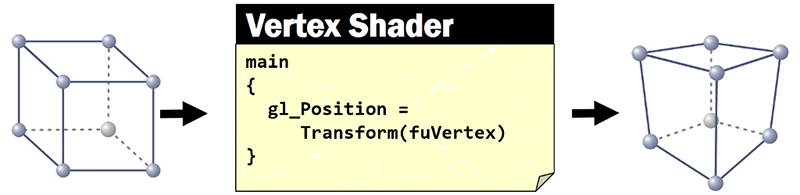
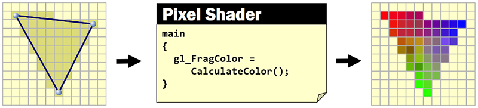
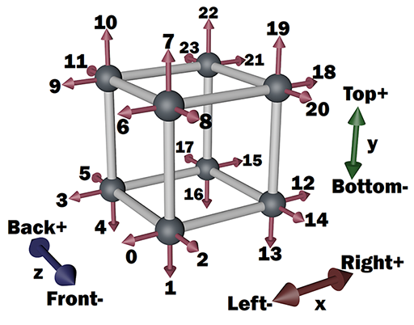
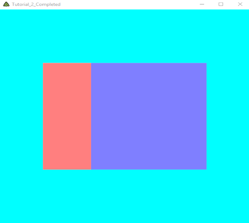
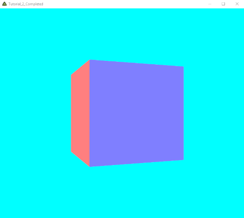
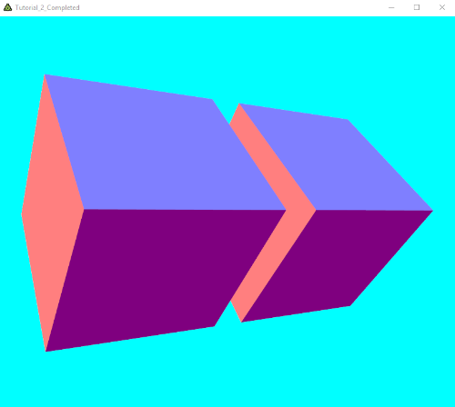
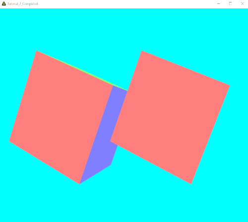
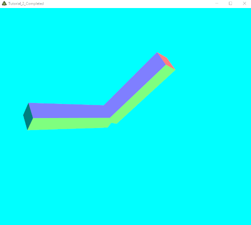
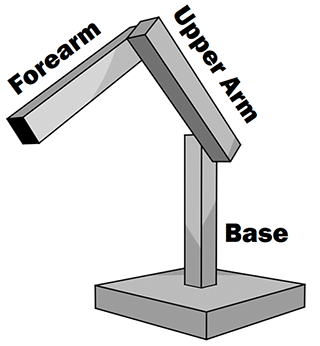

# Tutorial 3

## Goals
* Get a better understanding of the shaders' tasks.

* Understand why we need 4x4 matrices (and not 4x4) to perform transformations.

* Grasp the indexing scheme in `Mesh` and how edges in geometry require that vertices are passed through the vertex shader more than once.

* Get a first glance how object hierarchies are built using composite transformations.

## Get that 3D Look

In the tutorials so far, the generated output looked rather flat. Even the 3D-tetrahedron in [Tutorial 2](../Tutorial_2) really looked rather like a flat triangle. This has two reasons:

1. The individual pixel's colors are not calculated in a way that makes the objects appear 3D.

2. So far we used a parallel projection instead of perspective projection to display 3D coordinates on a 2D display.

While we will address reason 1 in one of the upcoming tutorials, right now we want to take a closer look at coordinate transformation.

## Shaders revisited
First, let's revisit what we already know about the rendering pipeline and shaders. As we already know, a vertex shader is called for each vertex passed through the rendering pipeline. One of the main goals a vertex shader has to accomplish is to transform coordinates from the coordinate system they are in when they enter the rendering pipeline to a coordinate system that resembles the display's (two) main axes.



Without being too exact you could say: The vertex shader transforms each vertex from model coordinates to screen coordinates. It's not quite exact because, as you already observed, the vertex shader's output coordinate system ranges from -1 to 1 in both screen dimensions, x and y. "Real" screen coordinates would be 2D-indices to individual pixels. So the coordinate system that the vertex shader needs to produce coordinate values for is a somehwat "normalized" screen coordinate system where -1 means left (in x direction) or top (in y direction), and +1 means right (for x) or bottom (for y). In addition, very often the vertex shader also performs other tasks, like setting up values needed in the lighting calculation or animation.

As sson as these "screen" coordinates are known for all three vertices of a triangle, the render pipeline can figure out which pixels need to be filled with color. Then for each of these pixels, the pixel shader (provided by you, the programmer) is called. this process is called rasterization.



Once the rendering pipeline knows which of the screen's pixels are covered by geometry (the dark pixels on the left side of the image above), it can call the pixel shader to do its task and fill any of the pixels covered by geometry with an individually calculated color.

## Normal
Open the `Tutorial_3` folder in Visual Studio Code and look into the file [Tutorial_3](Tutorial_3.cs). the mesh has become a lot more complex now. We want to display a cube. With what we already know, we should think a cube is made out of eight vertices and each of the six faces made out of two triangles, so twelve triangles hooked on eight vertices. But now we want to display different faces with different colors. To do this (and also prepare for more accurate color calculation) we specify the face normals with the vertices. this way, the vertex shader can access the orientation of the face at that special vertex. BUT: Since each vertex of the cube is shared by three faces, we need to specify three normals for each vertex. this is not possible, so all we can do is to duplicate each vertex position two times. This way we have three "physical" vertices at each of the eight different vertex position - in sum 24 vertices. the following image shows the indices of the 24 vertices in the `_mesh` indicated by the respective normal.



Besides the changed _mesh geometry, there are three more changes applied to the code compare to the [completed Tutorial_2 source code](../Tutorial_2_Completed):

1. The mouse input in `RenderAFrame` is only applied to the rotation angle if the left mouse button is pressed.

2. Touch input is processed as an alternative to mouse input to allow interaction on touch devices.

3. The geometry is scaled by 0.5 in each dimension in the vertex shader. Since the cube's vertices are all positioned one unit away from the coordinate system's origin, we need to downscale the cube to avoid clipping part of it if it's rotated.

Debugging `Tutorial_3` should result in the following:


### Practice
* Take a look at `_mesh.Vertices` and `_mesh.Normal` and understand that one index in `_mesh.Triangles` identifies a pair of one vertex and one normal.

* try to match the contents of `_mesh.Vertices` and `_mesh.Normal` with the image above: For a given index find the vertex and normal in the image above and check that the image is correct from vertex' and the normal's coordinate.

## Normal Shading
Now we need to pass trough the normal information provided with the vertices. If a mesh contains normals, FUSEE already passes the normals to the vertex shader through the reserved attribute `fuNormal`. This is just the same way as a mesh's vertices are passed to the vertex shader through `fuVertex`. Since this tutorial is not yet about lighting calculation, we just want the normal to be present in the pixel shader. So we add a variable `varying normal` to both, the vertex and the pixel shader and assign to it the incoming normal form `fuNormal` in the vertex shader. In the pixel shader, we can then use the information contained in `normal` instead of the contents of `modelpos` as a pixel color. The following code snippets contain the code changes to the shaders:

* Vertex Shader:
    ```GLSL
    attribute vec3 fuVertex;
    attribute vec3 fuNormal;
    uniform float alpha;
    varying vec3 modelpos;
    varying vec3 normal;

    void main()
    {
        modelpos = fuVertex;
        normal = fuNormal;
        float s = sin(alpha);
        float c = cos(alpha);
        gl_Position = vec4( 0.5 * (fuVertex.x * c - fuVertex.z * s),
                            0.5 * fuVertex.y,
                            0.5 * (fuVertex.x * s + fuVertex.z * c),
                            1.0);
    }
    ```

* Pixel Shader
    ```GLSL
    #ifdef GL_ES
        precision highp float;
    #endif

    uniform DiffuseColor;
    varying vec3 modelpos;
    varying vec3 normal;

    void main()
    {
        gl_FragColor = DiffuseColor * vec4(normal * 0.5 + 0.5, 1.0);
    }
    ```

Debugging the program should show you how the cube geometry now has a unique single color applied to every face now.



### Practice
* Rotate the cuve and explain for each of the four visible faces of the cube which normal value is responisble for the color give to that face.

## Transformations = Matrices
What the vertex shader needs to do is: Perform transformations on incoming coordinates. Typically, the transformation performed on each vertex is a composition of a long list of individual simple transformations. Consider a car racing game where for a single frame, the model of a wheel of the car should be rendered. Each vertex of the wheel model is passed into the pipeline in the wheel's model coordinate system. From there it should be transformed into the coordinate system of the car's body, so a translation and some rotations must be applied. The whole scene is seen from some virtual camera which is positione and oriented somewhere within the world. So to yield screen coordinates the inverted camera's position and orientation must be applied and at the end the generated image should be perspectively projected. To accomplish that, a projection transformation needs to be applied that minimizes distances between vertices far away and magnifies distances between near vertices.

Since geometry typically consists of huge amounts of vertices, it is desirable to cummulate a long list of transformation into one single resulting transformation that can be applied in one single step to each vertex. This is where matrices come into play. As we saw in [Tutorial 1](../Tutorial_1), mathematically we can describe a transformation such as a rotation in matrix form. Matrix calculus is associative, which means we can either take a vertex, multiply it to the first of a long list of matrices, take the result and multiply it with the second matrix etc., or we can first multiply all matrices in the order of application and have one resulting matrix which can be applied to all vertices sharing the same transformation.

In FUSEE we are using colum-order notation of matrix calculus, where a vector is multiplied from the right. Thus, a list of matrices applied to a vector would be written as:

```
M3 * M2 * M1 * v
```

where v is a vector and M1 is the first transformation to be applied to v and M3 the last transformation. So according to the associative law instead of calculating each matrix one by one we can first multiply all transformation matrices into one single resulting transformation and apply this to the vector.

```
(M3 * M2 * M1) * v = MRes * v
```

The advantage of the right side is the following: If you have a lot of vertices that need to be transformed in the same way, you save a lot of calculations.

So let's say a big thank you to the inventors of matrix calculation. BUT - there is one drawback: The building blocks we want to use to build our composite transformation are:

* Translation (changing position)
* Rotation
* Scale (make objects bigger or smaller)
* Projection (here: perspective projection making far objects appear smaller)

Unfortunately, only two of these transformation types (rotation and scale) can be expressed with 3x3 matrices. However, using 4x4 matrices and applying some mathematical tricks on how to make 3D vectos 4D before applying matrix calculation and bringing them back to 3D afterwards, we can indeed express translations and perspective projection and still have that nice feature called associative law.

We don't need to go into maths much deeper now. But you should know now why we operate with 4x4 matrices although all we want to do is transform 3D vertices.

## Matrix as Uniform Parameter
As we know now, we can compose complex transformations from simple "atomic" transformations like translation, rotation, and scale. Instead of doing matrix calculations in the vertex shader (where we need the transformation), we compose one single matrix outside the vertex shader, which we then apply to all incoming vertices belonging to one mesh.

So we rewrite our vertex shader to accept a uniform matrix variable that will be applied to the vertex it is called for. The datatype for 4x4 matrices in GLSL (our shader language) is `mat4`. The datatype defined by FUSEE for 4x4 matrices is `float4x4`.

In the vertex shader, replace the uniform variable `alpha` which we used to hold the current rotation angle with a variable called `xform`.

```glsl
attribute vec3 fuVertex;
attribute vec3 fuNormal;
uniform mat4 xform;
varying vec3 modelpos;
varying vec3 normal;

void main()
{
    modelpos = fuVertex;
    normal = fuNormal;
    gl_Position = xform * vec4(fuVertex, 1.0);
}
```

Instead of handling `alpha` as a shader variable from the "outside" C# code, we now need ot handle `xform`. Note that we do not completely delete `_alpha`. Apply the following changes to the C# code:

* Declaration:

    ```csharp
    private float4x4 _xform;
    private float _alpha;
    ```

* Inside `Init`:

    ```csharp
    _xform = float4x4.Identity;

    _shaderEffect = new ShaderEffect(
        new[]
        {
            new EffectPassDeclaration{VS = _vertexShader, PS = _pixelShader, StateSet = new RenderStateSet{}}
        },
        new[]
        {
            new EffectParameterDeclaration { Name = "DiffuseColor", Value = new float4(1, 1, 1, 1) },
            new EffectParameterDeclaration { Name = "alpha", Value = _alpha }
        }
    );
    ```

* Inside `RenderAFrame`:

    ```csharp
    if (Mouse.LeftButton || Touch.GetTouchActive(TouchPoints.Touchpoint_0))
        _alpha -= speed.x * 0.0001f;

    _xform = float4x4.CreateRotationY(_alpha) * float4x4.CreateScale(0.5f);
    _shaderEffect.SetEffectParam("xform", _xform);
    ```

    Note that we changed the operation on `_alpha` from `+=` to `-=`. This is due to the fact that from now on we will be using FUSEE's matrix calculation methods, which operate on a left-handed coordinate system, instead of the rigt-handed coordinate system implicitly assumed by OpenGL.

Debug these changes and make sure the output is the same as before.

### Practice
* Understand the changes applied above. Not how we now have one single matrix (`xform`) which we can use to apply any transformation to.

* Try to compose `_xform` out of more transformations, probably also controlled by input axes. See which other transformations can be created by the various `float4x4.Create...` method.

* Try to change the order of the individual transformations your `_xform` is composed of and explain what happens. In which order are the transformations applied to a vertex?

* Explain why it is better to compose `_xform` in the C# code, rather than composing it in the vertex shader.

## Perspective and Aspect Ratio
Now we are ready for 3D! The coordinates our vertex shader writes out to `gl_Position` as the resulting screen coordinates are in 4D: `(x, y, z, w)`. The rendering pipeline takes these coordinates as they drop out of our vertex shader and further processes them as follows:

1. Make a 3D coordinate out of the 4D coordinate by dividing the first three coordinates by the last:

    ```
    (x, y, z, w) -> (x/w, y/w, z/w)
    ```

2. Use the first two coordinate axes (x and y) as the screen coordinate axes. Using the resulting z value (z/w) as the depth of that vertex. The depth will be used in per-pixel occlusion calculations (z-buffer) later on.

So far, the transformation provided in `xform` didn't apply any changes to x and y based on the vertex' distance to the viewer (e.g. its z-coordinate). From a natural viewing, our experience is that distances far away appear much smaller than distances directly before our eyes. To create this perspective veiwing, we need to provide a transformation (in `_xform` that makes a vertex' x and y coordinates smaller, if that vertex' z-coordinate is big and vice versa).

We can do this by providing a matrix that writes a w-coordinate into the resulting vertex which is very much the coordinate's z-value. Because later on, the rendering pipeline will divide x and y by w, the result will right what we desire: A perspective projection where object s far away are smaller than objects close to the viewer.

Don't worry, you won't have to bother with how to set up a matrix that accomplishes this. You can simply use `float4x4.CreatePerspectiveFieldOfView` to have FUSEE calculate a matrix for you. this method takes four arguments:

1. the field of view angle of the horizontal axis which is the opening angle of the camera, provided in radians. there is a 1:1 relation of this angle to the focal distance used in photography to measure the opening angle (or the "zoom factor").

2. The current aspect ratio of the rendering window (a.k.a. the viewport). this value is used to stretch or shrink values along the vertical axis to compensate for non-square rendering windows.

3. The *Near Clipping Plane*. Vertices with smaller z values than this will be clipepd (not visible).

4. The *Far Clipping Plane*. Vertices with bigger z values than this will also be clipped (not visible).

Now let's use `float4x4.CreatePerspectiveFieldOfView`. Change the place in `RenderAFrame` where you assemble your `_xform`-Matrix:

```csharp
var aspectRatio = Width / (float)Height;
var projection = float4x4.CreatePerspectiveFieldOfView(M.Pi * 0.25f, aspectRatio, 0.01f, 20);
_xfrom = projection * float4x4.CreateTranslation(0, 0, 3) * float4x4.CreateTranslationY(_alpha) * float4x4.CreateScale(0.5f);
```

Building and running this now shows a cube perspectively displayed from the side.



### Practice
* Note that we needed to insert a translation about 3 units along the z-axis. Understand that this is necessary to move the geometry into a visible range between the near and the far clipping plane. What happens if we omit this translation?

* If you didn't until now: Apply a second rotation around the x-axis controlled by the mouse- or touch-velocity along the screen's y-axis to see the top and bottom faces of the cube.

* What happens if you change the order of the translation and the rotation(s) in `_xform`?

## More Cubes
Now, let's add another cube. We can display two cube just by rendering our single cube twice and change the transformation matrix between the two rendering operations to make the cubes appear at different places. Here's the complete `RenderAFrame` implementation doing that:

```csharp
public override void RenderAFrame()
{
    // Clear the backbuffer
    RC.Clear(ClearFlags.Color | ClearFlags.Depth);

    float2 speed = Mouse.Velocity + Touch.GetVelocity(TouchPoints.Touchpoint_0);
    if (Mouse.LeftButton || Touch.GetTouchActive(TouchPoints.Touchpoint_0))
    {
    	_alpha -= speed.x*0.0001f;
    	_beta  -= speed.y*0.0001f;
    }

    // Setup matrices
    var aspectRatio = Width / (float)Height;
    var projection = float4x4.CreatePerspectiveFieldOfView(M.Pi * 0.25f, aspectRatio, 0.01f, 20);

    // First cube
    _xform = projection * float4x4.CreateTranslation(0, 0, 3) * float4x4.CreateRotationY(_alpha) * float4x4.CreateRotationX(_beta) * float4x4.CreateTranslation(-0.6f, 0, 0) * float4x4.CreateScale(0.5f);
    _shaderEffect.SetEffectParam("xform", _xform);
    RC.Render(_mesh);

    // Second cube
    _xform = projection * float4x4.CreateTranslation(0, 0, 3) * float4x4.CreateRotationY(_alpha) * float4x4.CreateRotationX(_beta) * float4x4.CreateTranslation(0.6f, 0, 0) * float4x4.CreateScale(0.5f);
    _shaderEffect.SetEffectParam("xform", _xform);
    RC.Render(_mesh);

    // Swap buffers: Show the contents of the backbuffer (containing the currently rendered farame) on the front buffer.
    Present();
}
```

Debuggin this so far should produce two cubes rotating around a common center in two axes. (You might introduce `private float _beta` as a field to contain the second rotation angle.)



### Practice
* Change the order of rotations and translation in both `_xform` assignments above. Here's how to do it for one:

    ```csharp
    //First cube
    _xform = projection * float4x4.CreateTranslation(0,0,3) * float4x4.CreateTranslation(-0.6f, 0, 0) * float4x4.CreateRotationY(_alpha) * float4x4.CreateRotationX(_beta) * float4x4.CreateScale(0.5f);
    ```

    Now you should have two cubes but each is rotating arounds its own center.

    

Creating and multiplying nearly the same matrices for both cubes is not at all good in terms of performance, so we will store them in variables instead.

```csharp
// Setup matrices
var aspectRatio = Width / (float)Height;
var projection = float4x4.CreatePerspectiveFieldOfView(M.Pi * 0.25f, aspectRatio, 0.01f, 20);
var view = float4x4.CreateTranslation(0, 0, 3) * float4x4.CreateRotationY(_alpha) * float4x4.CreateRotationX(_beta);

//First cube
_xform = projection * view * float4x4.CreateTranslation(-0.6f, 0, 0) * float4x4.CreateScale(0.5f);
_shaderEffect.SetEffectParam("xform", _xform);
RC.Render(_mesh);
```

## Parent-Child relations
Now we want to make one cube a child of another. That means we need to apply all transformations we put on one cube to the second cube as well, before we apply the second cube's transformations. We want to control each cube's local yaw (rotation around the y-axis) and pitch (rotation around the x-axis) using the keyboard, so we need to store these angles as fields on the class level:

```csharp
private float _yawCube1;
private float _pitchCube1;
private float _yawCube2;
private float _pitchCube2;
```

Then, in `RenderAFrame` control two rotation angles with some of the axes provided by the `Keyboard` static Input-property.

```csharp
_yawCube1 -= Keyboard.ADAxis * 0.1f;
_pitchCube1 += Keyboard.WSAxis * 0.1f;
_yawCube2 -= Keyboard.LeftRightAxis * 0.1f;
_pitchCube2 += Keyboard.UpDownAxis * 0.1f;
```

to create a fully-fledged model-transformation we want to combine a translation along a 3D vector, and three rotations, each around the main axes. Rotation should take place around a freely defined rotation center, so before applying rotations, we need to translate the entire model to the rotation center (pivot point) and out of that point afterwards. Because we will be applying this combined transformation for each model we are about to display we will create a method for that. On the class leve, define the following method:

```csharp
static float4x4 ModelXForm(float3 pos, float3 rot, float3 pivot)
   {
    return float4x4.CreateTranslation(pos + pivot) * float4x4.CreateRotationY(rot.y) * float4x4.CreateRotationX(rot.x)
    * float4x4.CreateRotationZ(rot.z) * float4x4.CreateTranslation(-pivot);
}
```

Now we can call this method from within `RenderAFrame` for each model we want to transform.

```csharp
//First cube
var cube1Model = ModelXForm(new float3(-0.6f, 0, 0), new float3(_pitchCube1, _yawCube1, 0), new float3(0, 0, 0));
_xform = projection * view * cube1Model * float4x4.CreateScale(0.5f, 0.1f, 0.1f);
_shaderEffect.SetEffectParam("xform", _xform);
RC.Render(_mesh);

//Second cube
var cube2Model = ModelXForm(new float3(1.0f, 0, 0), new float3(_pitchCube2, _yawCube2, 0), new float3(-0.5f, 0, 0));
_xform = projection * view * cube1Model * cube2Model * float4x4.CreateScale(0.5f, 0.1f, 0.1f);
_shaderEffect.SetEffectParam("xform", _xform);
RC.Render(_mesh);
```

As a result, we can steer each cube individually: The left cube with keys `W`, `A`, `S`, and `D`, and the right cube using `Left`, `Right` , `Up`, and `Down`.

Still, both cubes are indipendent from another. To change that, introduce the following changes to `RenderAFrame`:

* Scale both cubes to make them appear as bars.

    ```csharp
    float4x4.CreateScale(0.5f, 0.1f, 0.1f);
    ```

* Apply all transformations of the first cube to the second cube as well.

    ```csharp
    _xfrom = projection * view * cube1Model * cube2Model * float4x4.CreateScale(0.5f, 0.1f, 0.1f);
    ```

* Translate the second cube relateive to the first cube (1 along the x axis).

* Make the second cube rotate around its right border, rather than its center. (Set pivot point to `new float3(-0.5f, 0, 0)`.)

As a result, you should be able to control the overal rotation of the arm using WASD and additionally control the joint connecting both bars using the arrow keys.



## Exercise
* Create a little robot made out of a base, an upper arm, and a forearm. Use two cubes to build the base, and one cube each for the upper arm and forearm.

    

* Use the `Keyboard` axes to control the yaw of the base and the pitches of upper arm and forearm.

* Set the arms pivot points to simulate physical joints at the connecting points.

* Limit the camera pitch movement (`_beta`) to the range from -PI/2 to PI/2.

* For touch devices: Try to figure out how to best match the five degrees of freedom (Camera pitch and yaw, three robot axes) to the six existing touch axes: Single point speed (2D), Two-Point-Midpoint-Speed (2D), Two-Point-Distance-Speed(1D), Two-Point-Angle-Speed (1D).