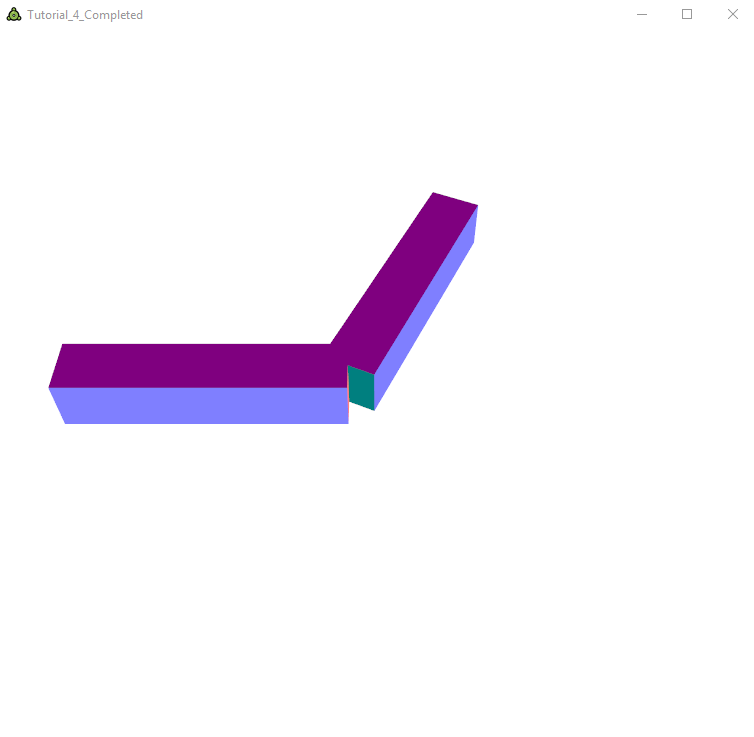

# Tutorial 4

## Goals
* Learn to load 3D models as assets.
* Understand Fusee's built-in ModelView and Projection matrices.
* see how hierarchical geometry can be handled in object hierarchies.
* Implement a very simple lighting calculation in the pixel shader.

## Reading Meshes From Files
FUSEE coems with a set of classes designed to be written to and loaded from files (serialized). These classes are containers for data types typically found in 3D scens, such as polygonal geometry, material (color) settings, textures, and hierarchies. In this tutorial we will only look at how to read mesh geometry from files in the FUSEE file format (*.fus).

Open and debug Tutorial_4. The result will show more or less the state where we left off at [Tutorial 3](../Tutorial_3):



The only visible change is that the background color changed from dark green to white.

But let's look under the hood and try to understand what happened here first. Open `Tutorial_4.cs` and look at the `Init` method:

```csharp
public override void Init()
{
    //Set the clear color for the backbuffer to white.
    Rc.ClearColor = new float4(1, 1, 1, 1);

    _xform = float4x4.identity;

    //Create a new ShaderEffect 
    _shaderEffect = new ShaderEffect(
        new[]
        {
            new EffectPassDeclaration{VS = _vertexShader, PS = _pixelShader, StateSet = new RenderStateSet{}}
        },
        new[]
        {
            new EffectParameterDeclaration { Name = "DiffuseColor", Value = new float4(1, 1, 1, 1) },
            new EffectParameterDeclaration { Name = "xform", Value = _xform }
        }
    );

    RC.SetShaderEffect(_shaderEffect);

    //Load the scene file "Cube.fus"
    SceneContainer scene = AssetStorage.Get<SceneContainer>("Cube.fus");

     //Extract the First object of type Mesh found in scene's list of Children. ('c => true' means: any found MeshComponent will do)
    _mesh = scene.Children.FindComponents<Mesh>(c => true).First();
}
```

You may notice that the explicit definition of the cube geometry, where every one of the 24 vertices and normals was listed, together with the 12 triangles making up the cube, is no longer there. We still have the `_mesh` field instantiated with a `Mesh` object which is taken from the loaded `.fus` file.

`Mesh` is one of the serialization classes, together with `SceneContainer`, which are used as storage objects that can be written to and loaded from files. Look at the line `SceneContainer scene = AssetStorage.Get<SceneContainer>("Cube.fus");`: This is where a file called `Cube.fus` is loaded, similarly to the shaders we loaded and used from the AssetStorage since [Tutorial 1](../Tutorial_1).

Any file within the Assets folder will be added as an asset to the resulting application on the respective platform (.exe on desktop, .html file and folder structure in web). All assets added in this way can be loaded with the`AssetStorage.Get<>()` method.

The next line extracts a `Mesh` object from the `SceneContainer` stored in `Cube.fus`. The content of a *.fus file is a tree-like structure starting with a root node of type `SceneContainer`. Somewhere within the tree there can be `Mesh` objects storing chunks of geometry data. In `Cube.fus`, there is only one such object.

To conclude the changes applied to the completed state of Tutorial 3 in order to yield the initial state of Tutorial 4 it should be mentioned that the namespaces `Fusee.Xene`, `System.Linq`, as well as `System.Collections.Generic`were announced with `using` statements at the top of the source code file.

## Using FUSEE's Standard Matrices
Instead of using our self-defined `_xform` we can use a set of matrices which are maintained by FUSEE's render context (`RC`) and automatically propagated from the main application runnign on the CPU to the vertex shader on the GPU. The two commonly used matrices are the `ModelView` and the `Projection` matrices.

From the CPU-Code (e.g. from inside `RenderAFrame`) you can access (typically write) these two matrices usign the `RC.ModeView` and the `RC.Projection` properties. These are defined as `float4x4` properties - the FUSEE standard type for matrices. From within your shader code, you can access these matrices by defining `uniform` properties with special names. Here you can, for example, declare variables like `uniform vec4 FUSEE_MV;` and read out the values currently set from CPU-Code. You can also access premultiplied versions of `ModelView` and `Projection` as well as inverted or transposed versions of all kinds of combinations of the above. In particulare, the following matrices are available:

| CPU-Code Name                     | CPU-Code Access   | Shader-Code Declaration       | Description                                                       |
| ---                               | ---               | ---                           | ---                                                               |
| `RC.ModelView`                    | Read/Write        | `uniform mat4 FUSEE_MV`       | The Model-View matrix transforming from model to camera space.    |
| `RC.Projection`                   | Read/Write        | `uniform mat4 FUSEE_P`        | The Projection matrix transforming from camera to clip space.     |
| `RC.ModelViewProjection`          | Read              | `uniform mat4 FUSEE_MVP`      | The combined (multiplied) result of `MV * P`.                     |
| `RC.InvModelView`                 | Read              | `uniform mat4 FUSEE_IMV`      | The inverted Model-View matrix.                                   |
| `RC.InvProjection`                | Read              | `uniform mat4 FUSEE_IP`       | The inverted Projection matrix.                                   |
| `RC.InvModelViewProjection`       | Read              | `uniform mat4 FUSEE_IMVP`     | `Invert(MV*P)`                                                    |
| `RC.TransModelView`               | Read              | `uniform mat4 FUSEE_TMV`      | The transposed Model-View matrix.                                 |
| `RC.TransProjection`              | Read              | `uniform mat4 FUSEE_TP`       | The transposed Projection matrix.                                 |
| `RC.TransModelViewProjection`     | Read              | `uniform mat4 FUSEE_TMVP`     | `Transpsoe(MV*P)`                                                 |
| `RC.InvTransModelView`            | Read              | `uniform mat4 FUSEE_ITMV`     | The inverted transposed Model-View matrix.                        |
| `RC.InvTransProjection`           | Read              | `uniform mat4 FUSEE_ITP`      | The inverted trasposed Projection matrix.                         |
| `RC.InvTransModelViewProjection`  | Read              | `uniform mat4 FUSEE_ITMVP`    | `Invert(Transpsoe(MV*P))`                                         |

Quite a lot - but keep in mind that these matrices are the vehicles that bring coordinates back and forth through the various steps taken by geometry when transfromed from model coordinates into clip coordinates. In upcoming tutorials we will se a number of examples where some of the above matrices will be used. In this tutorial, we will only write to `RC.Modelview` and `RC.Projection`and read the product of these in the vertex shader out of `uniform vec FUSEE_MVP`. To do this, follow these steps:

* Inside the vertex shader, simply replace any mention of `xform` with `FUSEE_MVP`.

* On the class level of `Tutorial_4.cs`, you can completely remove the declaration of the field `private float4x4 _xform`.

* Inside `Init`, completely remove the initialization of `_xform` and the `EffectParameterDeclaration`containing `_xform`.

* Inside `RenderAFrame()` assign the calculation result for the projection matrix directly to `RC.Projection`. Remove the local variable `projection`:
