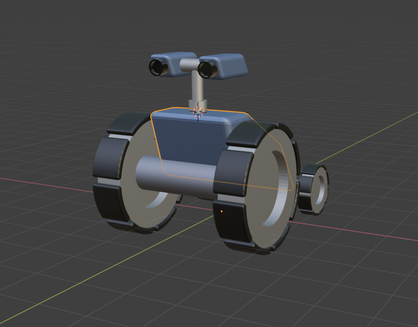

# Tutorial 5

## Goals
* Understand FUSEE's built-in SceneGraph and traversal functionality.

* Implement a more complex shader with specular component.

## FUSEE's built-in SceneGraph
In Tutorial 4 we created a simple class, `SceneOb`, that we used to create hierarchical scene graphs. In addition, we added a method `RenderSceneOb` that wen through a tree of `SceneOb` instances and rendered the contents of the individual `SceneOb`s. From now one we will call the process of going through a hierarchy of objects ***traversing*** the tree and a hierarchy of objects making up parts of a 3D scene a ***Scene Grap***.

FUSEE already comes with a set of classes allowing to build up Scene Graphs. You can find these classes in the [Fusee.Serialization](https://github.com/FUSEEProjectTeam/Fusee/tree/develop/src/Serialization) project. All classes found there can be serialized and deserialized, using automatically generated serialization code. In Tutorial 4 you already used these classes to load a `.fus` file and retrieve some Mesh data out of it. But `.fus` can not only store simple meshes - it can contain complete scene graphs.

A Scene Graph in FUSEE is always a tree of `SceneNodeContainer` objects (we will just call them *nodes*). Take a look at the [source code](https://github.com/FUSEEProjectTeam/Fusee/blob/develop/src/Serialization/SceneNodeContainer.cs) and you will notice that its declaration is very short: besides a name, each node is only made up of two lists:

1. A list of `SceneComponentContainer` objects - we will just call them *components*.
2. A list of child nodes - this is how a hierarchy can be built, just like we did with our `SceneOb`s.

Let's talk about components a little bit. In the `Fusee.Serialization` project you can find a lot of classes derived from `SceneComponentContainer`, such as:

* `Mesh` - you already dealt with it in Tutorial 4.
* `TransformComponent` - contains a position, rotation, and scale information.
* `MaterialComponent` - contains a material description (e.g. a color).

just to name a few. These components are the building blocks containing the contents a scene is made of. Not every node must contain a complete set of parameters. Some nodes are just there to group other nodes, so they don't contain any component at all. Some nodes might be a group and at the same time allow their children to be transformed simultaneously in world space. Such a node may contain a transform component only. Other nodes contain a complete set includign a mesh, a transform, and a material. And as you can see, there are more types of components which we will not talk about during this tutorial.

On the outermost level of a `.fus` file there is always one `SceneContainer`making the "root of the tree. We will simply call it a *scene*. It contains a list of `Children` of `SceneNodeContainer` objects. This is the list of nodes at the root level. In addition a scene contains some header information about the `.fus` file.

To summarize, you can imagine the contents of a `.fus` file as the example tree in the following image.


The orange object is the one-and-only `SceneContainer` root instance. the yellow squares are `SceneNodeContainer` objects (*nodes*), and the green rounded squares are different derivations of `SceneComponentContainer` instances (*components*).

The numbers are the order in which a traversal will visit each node and component.

Now let's look at an example of a scene. the following image is a hierarchical model created in Blender, a 3D modelling software:



Here you can see the scene graph inside the modelling software:


Now we want to load this scene in our source code. Add the model file `Wuggy.fus` to the Assets sub folder (if it is not there already) and add the following loading code to the `Init` method of the `Tutorial_5` class.

```csharp
SceneContainer wuggy = AssetStorage.Get<SceneContainer>("Wuggy.fus");
```

Set a breakpoint to the line right after the one above. Debuggin will break at the position right after deserializing the contents of `Wuggy.fus` into an object tree. Watch the `wuggy` variable in the debugger's window and inspect its contents: 


### Practice
* Draw an image of the hierarchy contained in `wuggy` using squares and circles like the image above.
* Convince yourself about the 1:1 connection of the hierarchy in the `wuggy` variable and the scene graph image from the modelling software.
* Look inside the various components. What information is contained in the `Mesh`, `TransformComponent`, and `ShaderEffectComponent` types.

## Rendering a Visitor
To render a scene like the one stored in `wuggy` we need to *recursively* traverse all `Children` of the root `SceneContainer`. We already implemented a simple rendering traversal with out `RenderSceneOb` method. But renderign is not the only purpose to traverse a scene. Here are two traversal reasons other than rendering:

* Find a node or component based on some search criterion (e.g. all nodes with a certain name, all meshes with more than 50 triangles, etc.)
* Picking - finding all meshes and nodes under a given position or within a rectangular range, given in screen space, such as the current mouse position.

So now we have the situation that we have a set of building blocks of different component types to build up our hierarchy and we also have a couple of different actions that should take place when traversing. So the action that occurs depends on two things:

1. The type of the component beign traversed.
2. The "reason" for traversing such as rendering, searching, picking, etc.

In computer science this problem and its solution istreated under the keyword ***Visitor Pattern***, or ***Double Dispatch***. FUSEE comes with an implementation based on the classical Visitor Pattern and some extensions built around it to enable programmers using scenes to easily implement their own traversals and at the same time extend the set of `SceneNodeContainer` classes for their own needs. these implementations around the core `SceneVisitor` class can be found in the [Fusee.Xene](https://github.com/FUSEEProjectTeam/Fusee/tree/develop/src/Xene) subproject. Youcan also find some additional information int the [Fusee.Xene.md](https://github.com/FUSEEProjectTeam/Fusee/blob/develop/src/Xene/Fusee.Xene.md) document.

To implement your own Rendering Visitor, you should do the following.

1. Create a class derived from `Fusee.Xene.SceneVisitor` and add three visitor methods for mesh, transform, and shader effect components:
    ```csharp
    using System;
    using System.Collections.Generic;
    using Fusee.Base.Common;
    using Fusee.Base.Core;
    using Fusee.Engine.Common;
    using Fusee.Engine.Core;
    using Fusee.Math.Core;
    using Fusee.Serialization;
    using Fusee.Xene;

    class Renderer : SceneVisitor
    {
        [VisitMethod]
        void OnMesh(Mesh mesh)
        {

        }

        [VisitMethod]
        void OnShaderEffect(ShaderEffectComponent shader)
        {

        }

        [VisitMethod]
        void OnTransform(TransformComponent xform)
        {

        }
    }
    ```
    The name of the class as well as the name of the methods may vary. Note how the methods are attributed with the `VisitMethod` attribute and how methods vary in the different parameter types all derived from `SceneComponentContainer`.

2. Add two fields in the `Tutorial` class: One to keep the `_wuggy` scene and another one to keep an instance of our newly created `Renderer`:
    ```csharp
    private SceneContainer _wuggy;
    private Renderer _renderer;
    ```

3. In the `Init` method, load the contents of Wuggy.fus into the `_wuggy` field and initiate an instance of our `Renderer`:
    ```csharp
    _wuggy = AssetStorage.Get<SceneContainer>("Wuggy.fus");
    _renderer = new Renderer();

4. In the `RenderAFrame`method, somwhere between `Clear()`ing the back buffer and `Present()`ing the contents to the front buffer, use our `Renderer` to traverse the wuggy scene:
    ```csharp
    _renderer.Traverse(_wuggy.Children);
    ```

Of course our renderer doesn't do anything right now, but you can already observe it visiting the components.

### Practice
* Set three breakpoints - one at the closing curly brace of each of the visitor methods defined in our `Renderer` class. Debug the program and observe the mesh, shader, and transform components as they are visited.
* While debugging, add the identifier `CurrentNode` to the Watch window. This way you can observe which node the currently visited component belogns to.
* Take your sketch of the scene graph from the previous practice block and identify which circle you're at while hopping from component to component using the F5 key.

Now you should get the idea how you could add code to the three empty methods to add the contents of the respective node to the render context `RC` during traversal.

There are some thigns missing though: using the three methods we can now track each of the components we're interested in while traversing. But we also need to be notified by the visitor before entering into a child list and also after all children of a child list are done visiting. In other words, we want to know if another step in the depth of the hierarchy is taken into whatever direction (in or out). Fortunately, the `SceneVisitor` class already provides this information. it calls the method `PushState()` when going one step deeper in the hierarchy of nodes and it calls `PopState()` when all nodes in a `Children` list havebeen visited and the traversal returns to the parent node.

If we want to add our own code when these events happen, all we need to do is to override these pre-defined methods. In the `Renderer` class, add the following methods:

```csharp
protected override void PushState()
{

}

protected override void PopState()
{

}
```

So altogether we should now have five empty methods in `Renderer`.

### Practice
* Set two more breakpoints at the closing curly braces and observe the visitor doing its work including oing down and up the hierarchy while looking at `CurrentNode` to see where the traversal is currently at.
* ***Advanced.*** Add functionality to output a structured text with the contents of `_wuggy` with indentations showing the level in the hierarchy. Add some syntactic sugar to your output to yield an XML or JSON file.

The two newly added methods' names already show what's typically done here: We need to perform push or pop operations on a stack-like data structure keeping track of the current tranversal state. For rendering we typically need to keep track of the current model-view matrix. Why? Because as you remember from `RenderSceneOb`, every visited node contributes its own local transformation to the overall model-view matrix. Whenever a child list is done rendering the original model-view matrix needs to be restored. In our new visitor approach, the right time for restoring is in `PopState()`. But here we need to know what the original matrix was. We can get access to the original matrix in `PushState()`.

Now let's add the missing stuff to make our `Renderer` do what it should.

* The `Renderer` needs access to the `RenderContext` because it will need to call its methods such as `Render()` and `SetShaderParam()`.
* We need a Stack to keep a list of matrices accessed in a "last in, first out" (LIFO) manner. The Fusee.Xene project also has some pre-fabricated building blocks for this. We will use the `CollapsingStateStack<float4x4>` data type. It has a `Push()` and a `Pop()` operation and we get access to the top of stack using the `Tos` property.
* For now we will only take the diffuse color from the `ShaderEffectComponent` objects.

Putting it all together we will end up with a `Renderer` like that:

```csharp
class Renderer: SceneVisitor
{
    public RenderContext RC;
    public flaot4x4 View;
    private CollapsingStateStack<float4x4> _model = new CollapsingStateStack<float4x4>();

    [VisitMethod]
    void OnMesh(Mesh mesh)
    {
        RC.Render(mesh);
    }

    [VisitMethod]
    void OnShaderEffect(ShaderEffectComponent shader)
    {
        RC.SetFXParam("albedo", shader.Effect.GetEffectParam("DiffuseColor"));
    }

    [VisitMethod]
    void OnTransform(TransformComponent xform)
    {
        _model.Tos *= xform.Matrix();
        RC.ModelView = View * _model.Tos;
    }

    protected override void PushState()
    {
        _model.Push();
    }

    protected override void PopState()
    {
        _model.Pop();
        RC.ModelView = View * _model.Tos;
    }

    protected override void InitState()
    {
        _model.Clear();
        _model.Tos = float4x4.Identity;
    }
}
```

Inside `Init` initialize some of the new renderer properties after the shader initialization.

```csharp
RC.SetShaderEffect(shaderEffect);

_renderer.RC = RC;
```

Inside `RenderAFrame` remove rendering the `SceneOb`s from Tutorial 4, set up the view matrix, and pass it to the `Renderer` like this:

```csharp
var view = float4x4.CreateTranslation(0, 0, 10) * float4x4.CreateRotationY(_alpha) * float4x4.CreateRotationX(_beta) * float4x4.CreateTranslation(0, -1, 0);

_renderer.View = view;
_renderer.Traverse(_wuggy.Children);
```

Debugging the program should result in the wuggy model shown.


### Practice 
Understand how the renderer operates.

* Again, set breakpoints in all methods and step through the traversal. see how transform, mesh, and shader effect components are processed.
* Understand what the `RC.ModelView = View * _model.Tos;` line does. Why can we find this line in `PopState()` and in `OnTransform()`?
* Debug into `LookUpMesh()`. What is the purpose of this method?
* Look up the definition of `TransformComponent.Matrix()` inside FUSEE's sources to see that this is pretty close to what our old `ModelXForm()` did.

## Assessing Scene Properties
Now we have a model that has a lot of parts that should be moved. Wheels should spin, the back wheels can be used to perform steering operations. The camera eyes can be rotated along two axes, and the camera mount can be extended. All this can be done now by changing values on transform components in the scene graph from outside. 
To access an individual model part, we can use a method similar to what we already used to find the meshes in the very simple .fus files from Tutorial 4, just by accessing model parts by their names. The following nodes are useful candidates for changing settings on their transform components in the `Wuggy.fus` file.

| Node Name             | Transformations   | Purpose                                           |
| ---                   | ---               | ---                                               |
| Neck_High             | Translation.y     | Height of the camera mount.                       |
| Neck_High             | Rotation.y        | Heading (Yaw) of cameras.                         |
| Head_Base             | Rotation.x        | Up/Down rotation (Pitch) of the cameras.          |
| Axle_Back/Front       | Rotation.x        | Rotation of the front or back axle (and wheels).  |
| Axle_Back             | Rotation.y        | Steering angle of the back axle.                  |
| Wheel_Back_Right/Left | Rotation.x        | Individual wheel rotation of the back wheels.     |
| Wheel_Front_Right/Left| Rotation.x        | Individual wheel rotation of the front wheels.    |

To access the left front wheels transformation component you can declare a field to reference the transform component on the `Tutorial_5` class level:

```csharp
private TransformComponent _wheelFrontLeft;
```

Then in `Init` right after loading the `Wuggy.fus` file you can find the transform component and store a reference to it using this expression:

```csharp
_wuggy = AssetStorage.Get<SceneContainer>("Wuggy.fus");
_wheelFrontLeft = _wuggy.Children.FindNodes(n => n.Name == "Wheel_Front_Left").First().GetTransform();
```

Translated into plain English the second line reads: "In the wuggy scene, get a list of nodes called "Wheel_Front_Left". Take the first of these nodes and retrieve the first transform component found in this node's list of components.

Finally, in `RenderAFrame` we can access this transform node before rendering and add an animation to it based on the state of the `W` and `S` keys.

```csharp
_wheelFrontLeft.Rotation += new float3(-0.05f * Keyboard.WSAxis, 0, 0);
```

Debug the application ad have fun pressing `W` and `S` to spin the front left wheel.

## More Realism by Specular Light
Now we want to blow up our shader to additionally handle a specular component of the light source which will add a bit more realism to the resulting images. The specular component creates highlights on the surfaces by simulating mirrors of the light source(s). To get an idea how the specular component is calculated, look at the following image:


The specular intensity at a point on the surface is high, if the angle between the surface normal (N) to the incoming light source (L) and the angle between N and the viewer (V) are nearly the same. In this situation, the viewer can see a mirror image of the light source at the position on the surface. To get a measure how good this mirror condition is given, we take the half-way vector between V and L and call it H. New we measure te angle between H and N. If it is 0, we have a perfect mirror condition. The bigger this angle gets, the less a viewer can see the light's mirror image on the surface. So again, we take the dot product to get a value of 1 if the angle between the two vectors H and N is 0, and which will be 0 if the angle is 90°. In addition, the material can define a value called "shininess", controlling how fast the intensity should go towards zero if the angle becomes bigger. Mathematically this can be achieved by taking the result of the dot product to the power of "shininess".

The higher the shininess, the smaller and sharper the highlight is. Lower shininess values result in bigger and blurrier highlights and thus simulate less glossy materials.

To start, we want to move all the shader related stuff from our `Init` method to the `Renderer`, since here we have a closer relation between the shader's parameters and the material rendering.

Add a constructor to the renderer class taking the render context as a parameter and remove all the shader effect initialization from `Init`.

```csharp
public Renderer(RenderContext rc)
{
    RC = rc;

    var vertexShader = AssetStorage.Get<string>("VertexShader.vert");
    var pixelShader = AssetStorage.Get<string>("PixelShader.frag");
    var shaderEffect = new ShaderEffect(
        new[]
        {
            new EffectPassDeclaration{VS = vertexShader, PS = pixelShader, StateSet = new RenderStateSet{}}
        },
        new[]
        {
            new EffectParameterDeclaration { Name = "albedo", Value = float3.One },
            new EffectParameterDeclaration { Name = "shininess", Value = 0 }
        }
    );
    RC.SetShaderEffect(shaderEffect);
}
```

In the `OnShaderEffect()` method, read the shininess out of the existing definition method and set the shininess parameter:

```csharp
[VisitMethod]
void OnShaderEffect(ShaderEffectComponent shader)
{
    RC.SetFXParam("albedo", shader.Effect.GetEffectParam("DiffuseColor"));
    RC.SetFXParam("shininess", shader.Effect.GetEffectParam("SpecularShininess"));
}
```

Now we can apply a couple of changes to the pixel and the vertex shader:

* The vertex shader now needs to supply the position of the vertex in view coordinates, because the pixel shader needs the position of the pixel in question given in view coordinates. Thus, the vertex shader needs to transform the incoming vertex with the ModelView matrix and store the result in a `varying` variable called `viewpos`.
* The pixel shader takes the interpolated `viewpos` which then holds the position of the pixel currently calculated in view coordinates.
* The pixel shader needs a more accurate version of the normal. Thus, the normal is normalized.
* The speculare intensity is calculated as described above.
* Finally, the speculare intensity is added to all color channels, highlighting the calculated pixel.

Here are the resulting vertex and pixel shaders.

Vertex Shader:
```csharp
attribute vec3 fuVertex;
attribute vec3 fuNormal;
uniform mat4 FUSEE_MVP;
uniform mat4 FUSEE_MV;
uniform mat4 FUSEE_ITMV;
varying vec3 viewpos;
varying vec3 normal;

void main()
{
    normal = normalize(mat3(FUSEE_ITMV) * fuNormal);
    viewpos = (FUSEE_MV * vec4(fuVertex, 1.0)).xyz;
    gl_Position = FUSEE_MVP * vec4(fuVertex, 1.0);
}
```

Pixel Shader
```csharp
#ifdef GL_ES
    precision highp float;
#endif

varying vec3 viewpos;
varying vec3 normal;
uniform vec3 albedo;
uniform float shininess;

void main()
{
    vec3 nnormal = normalize(normal);

    //Diffuse
    vec3 lightdir = vec3(0, 0, -1);
    float intensityDiff = dot(nnormal, lightdir);

    //Specular
    float intensitySpec = 0.0;
    if (intensityDiff > 0.0)
    {
        vec3 viewdir = -viewpos;
        vec3 h = normalize(viewdir + lightdir);
        intensitySpec = pow(max(0.0, dot(h, nnormal)), shininess);
    }

    gl_FragColor = vec4(intensityDiff * albedo + vec3(intensitySpec), 1);
}
```

Compiling and building all changes should result in the wuggy model shown with somehow exaggerated highlights:


See [Tutorial 5 Completed](../Tutorial_5_Completed) for the overall state so far.

## Exercise
* Toy around with specular and diffuse components in the pixel shader.
    * See what happens if we don't normalize the interpolated normal vector.
    * Try displaying the specular component only.
    * Let the user interactively change the shininess component with some keys and see what happens.
* Use the material properties `SpecularIntensity` and `SpecularColor` to reduce the highlights to the setting found in the material of the `.fus` file.
* Create a small application allowing users to drive the wuggy model around
    * Make the wheels spin corretly according to their size and the speed of wuggy over ground.
    * Make the back wheels turn according to left/right steering commands.
    * Make the cameras turn to focus a fixed position (e.g. the user).
    * Allow the user to extend/shring the camera mount using buttons.
* ***Advanced.*** Instead of parallel light shining in viewing direction, change the calculation to a point light (specified in view coordinates as a vec3 uniform variable). Animate the light position to see what is happening.